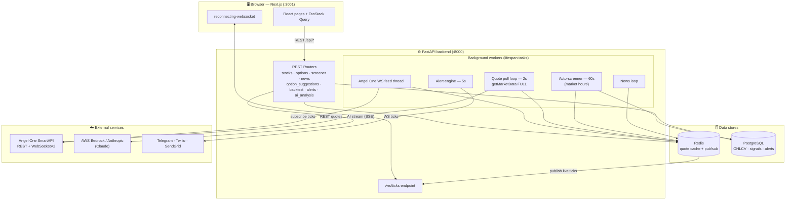
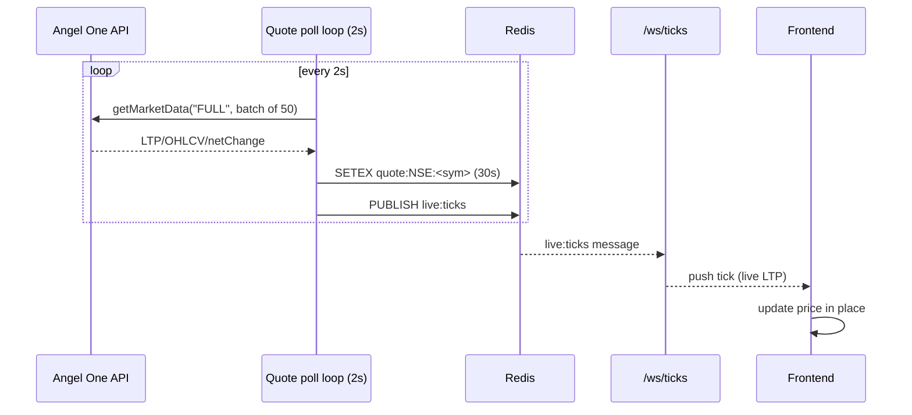
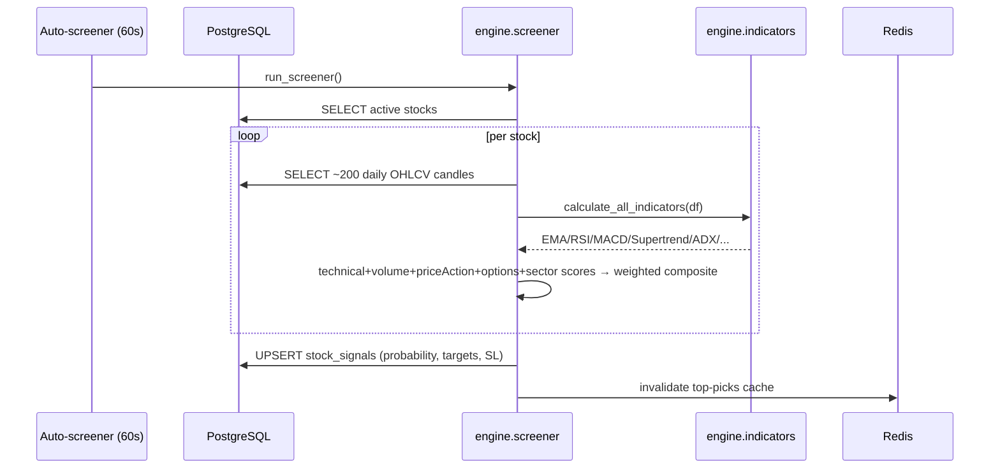
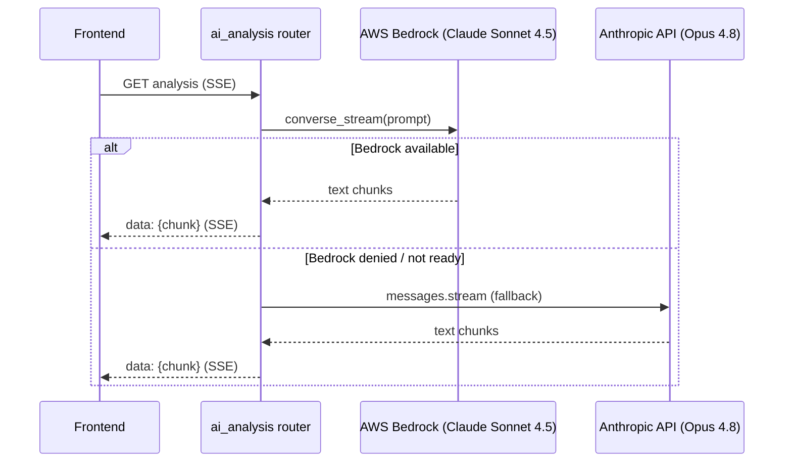

# StockSense India — Architecture & Workflow

> Real-time Indian (NSE/BSE) stock & options analytics platform.
> **Read-only by design**: it fetches market data and produces AI-assisted trade *analysis* — it **never** places, modifies, or cancels orders. All trading decisions are made manually by the user.

---

## 1. What it is

A full-stack analytics platform that:

- Streams **live quotes/ticks** for ~1,800 NSE stocks from the Angel One SmartAPI.
- Computes **15+ technical indicators** and runs an **AI probability screener** that scores stocks for 7-day / 15-day trade probability.
- Generates **options trade suggestions** (strikes, entries, targets, Greeks, max-pain/PCR) and lets you **backtest** strategies.
- Provides **AI commentary** on any stock via Claude (AWS Bedrock primary, Anthropic API fallback).
- Pushes **news, alerts, and circuit-breaker/F&O-ban** signals.

---

## 2. Technology Stack

| Layer | Technology |
|---|---|
| **Frontend** | Next.js 14.2 (App Router), React 18, TypeScript 5, TanStack Query 5, Zustand, Tailwind CSS, Radix UI, Framer Motion, Recharts + lightweight-charts, axios, `reconnecting-websocket`, react-hot-toast |
| **Backend API** | FastAPI 0.111, Uvicorn (`--reload` dev) / Gunicorn (prod), Pydantic v2, SlowAPI (rate limit), GZip middleware, Prometheus instrumentator, Sentry |
| **Compute engine** | Python 3.12, pandas, numpy, pandas-ta, scipy |
| **Market data** | Angel One **SmartAPI** (`smartapi-python`) — REST + `SmartWebSocketV2`, `pyotp` (TOTP login) |
| **AI / LLM** | Claude **Sonnet 4.5** via AWS Bedrock (`converse_stream`), **Opus 4.8** via Anthropic API (fallback), streamed over SSE |
| **Cache / bus** | Redis (`redis[hiredis]`) — quote cache + pub/sub (`live:ticks`) |
| **Database** | PostgreSQL 16 via SQLAlchemy 2 (async) + asyncpg; Alembic migrations |
| **Notifications** | python-telegram-bot, Twilio (SMS), SendGrid (email) |
| **Infra / ops** | Docker + docker-compose, nginx (reverse proxy, prod), `scripts/start.sh` (local one-command boot + watchdog) |

---

## 3. High-Level Architecture



### ASCII fallback (if Mermaid isn't rendered)

```
Browser (Next.js :3001)
   │  REST /api/*            ▲ WS /ws/ticks
   ▼                         │
FastAPI backend (:8000) ─────┘
   ├── REST routers ──► Redis (quote cache) ──► PostgreSQL (OHLCV, signals)
   ├── Quote poll (2s) ─► Angel One REST ─► Redis ─► publish live:ticks ─► WS clients
   ├── WS feed thread ──► Angel One WebSocketV2 (live ticks)
   ├── Auto-screener (60s) ─► reads OHLCV, scores stocks ─► writes stock_signals
   ├── News loop ─► Redis
   ├── Alert engine (5s) ─► Telegram / Twilio / SendGrid
   └── AI router ─► AWS Bedrock (Claude Sonnet 4.5) │ fallback Anthropic (Opus 4.8)
```

---

## 4. Component Breakdown

### Backend (`backend/`)
| Path | Responsibility |
|---|---|
| `main.py` | App factory, CORS/GZip/rate-limit middleware, **lifespan** (boots all workers), router wiring, `/health` |
| `data_fetcher.py` | Angel One session (TOTP login + Redis-cached JWT/feed tokens), REST quote/OHLCV/search, `SmartWebSocketV2` live feed with reconnect/heartbeat. **Read-only — order APIs are explicitly prohibited.** |
| `database.py` | Async SQLAlchemy engine + Redis accessor (`init_db`, `get_db`, `get_redis`) |
| `nse_calendar.py` | NSE trading-day / weekly-expiry (Tuesday) + holiday logic |
| `schemas.py` | Pydantic response models |
| `routers/` | `stocks`, `options`, `option_suggestions`, `screener`, `backtest`, `news`, `alerts`, `market`, `ai_analysis`, `websocket` |
| `services/alert_engine.py` | Evaluates price/circuit alerts, fans out to notification channels |

### Compute engine (`engine/`)
| File | Role |
|---|---|
| `indicators.py` | `calculate_all_indicators(df)` → EMA(9/21/50/200), SMA, VWAP (+bands), Supertrend, ADX, RSI, MACD, Bollinger Bands, ATR, Stochastic, OBV, MFI, candlestick patterns |
| `screener.py` | `run_screener()` → for each active stock: pull OHLCV, compute indicators, produce 5 sub-scores, weighted composite, rank, persist signals |
| `backtest.py` | Strategy backtester (win rate, profit factor, drawdown, Sharpe, equity curve) |

### Frontend (`frontend/src/`)
- `app/` — App-Router pages (see §8)
- `components/` — `charts`, `dashboard`, `screener`, `options`, `stock`, `layout`, `ui`
- `lib/api.ts` — axios client + typed API methods + the global error interceptor
- `lib/websocket.ts` — singleton `reconnecting-websocket` for `/ws/ticks`
- `hooks/`, `store/` (Zustand), `types/`

---

## 5. Data Model (PostgreSQL)

```mermaid
erDiagram
    stocks ||--o{ ohlcv_daily : has
    stocks ||--o{ ohlcv_1min : has
    stocks ||--o{ technical_indicators : has
    stocks ||--o{ stock_signals : generates
    stocks ||--o{ options_chain : has
    users ||--o{ watchlists : owns
    users ||--o{ price_alerts : sets

    stocks { string symbol PK_part string exchange string symbol_token bool is_active string sector int lot_size }
    ohlcv_daily { string symbol date open high low close volume }
    ohlcv_1min { string symbol timestamp open high low close volume }
    technical_indicators { string symbol string timeframe json values }
    stock_signals { string symbol float probability_score float target_7d float target_15d float stop_loss bool is_active }
    options_chain { string symbol float strike string type float oi float iv }
    watchlists { int user_id string name json symbols }
    price_alerts { int user_id string symbol float trigger string condition }
```

Migrations live in `database/migrations/` (`001_initial_schema.sql`, `002_local_dev.sql`).

---

## 6. Background Workers (started in `main.py` lifespan)

| Worker | Cadence | What it does |
|---|---|---|
| **Angel One WS feed** | continuous (thread) | Subscribes ~264 tokens (mode 2 = Quote), writes ticks to `quote:*`, publishes `live:ticks` |
| **Quote poll loop** | every **2 s** | `getMarketData("FULL")` in batches of 50 → cache `quote:NSE:<sym>` (30 s TTL) → `publish live:ticks`. This is the **primary** cache-warmer. |
| **Auto-screener** | every **60 s** (9:15–15:30 IST) | Runs `engine.screener.run_screener()`, persists signals, invalidates top-picks cache. (60 s = one 1-min candle; faster just hammers the DB.) |
| **News loop** | periodic | Refreshes news cache |
| **Alert engine** | every **5 s** | Evaluates alerts, dispatches notifications |

> **Startup sequence:** `init_db` → Redis connect → `initialize()` (Angel One **TOTP login**, cache JWT + feed token in Redis, 24 h TTL) → start WS feed → `ensure_future(_poll_quotes / _auto_screener / _news_loop)` → start alert engine.

---

## 7. Key Workflows

### 7.1 Live price flow (the heart of the app)



REST endpoints (`/quote`, `/screener/top-picks`, …) read the **same `quote:*` cache first** — so a warm cache means sub-millisecond responses; a cold cache forces a slow per-symbol `searchScrip` fallback (see §11).

### 7.2 AI probability screener



Composite score = weighted blend of **technical · volume · price-action · options · sector-relative** sub-scores; stocks above `BUY_THRESHOLD` become active signals, ranked by probability.

### 7.3 AI stock analysis (streaming)



### 7.4 Options suggestions
`/api/options/suggestions/<symbol>` → resolve nearest weekly expiry (NSE Tuesday, holiday-adjusted) → build chain snapshot (ATM ± strikes, Greeks, OI/IV) → derive market context (PCR, max-pain, IV-rank, trend) → emit ranked CE/PE trade ideas with entry/target/SL/RR, capital, and rationale.

---

## 8. Frontend Pages (App Router)

| Route | Purpose |
|---|---|
| `/` | Dashboard — trending, market status, live tickers |
| `/screener` | AI probability signals (filter by min probability/confidence) |
| `/options`, `/option-suggestions`, `/option-signals` | Options chain, AI options trade ideas, signals |
| `/backtest` | Strategy backtesting + metrics |
| `/sectors`, `/market-breadth`, `/multi-timeframe` | Market structure views |
| `/news`, `/alerts` | News feed, alert management |
| `/watchlist`, `/portfolio`, `/trade-journal` | Personal tracking |
| `/strategy-builder`, `/settings` | Payoff builder, configuration |

---

## 9. API Surface (selected)

| Method | Path | Notes |
|---|---|---|
| GET | `/health` | Liveness (HTTP only — see §12) |
| GET | `/api/stocks/trending` · `/market-status` · `/{sym}/quote` · `/{sym}/historical` · `/{sym}/indicators` | Quotes & TA |
| GET | `/api/screener/signals` · `/top-picks` · POST `/run` | Screener |
| GET | `/api/options/{sym}/chain` · `/pcr` · `/suggestions/{sym}` | Options |
| POST | `/api/backtest/run` · GET `/quick/{sym}` | Backtesting (long timeout) |
| GET | `/api/news` · `/breaking` | News |
| GET/POST | `/api/alerts/*`, `/api/trades/*` | Alerts & journal |
| WS | `/ws/ticks` | Live tick stream |
| GET (SSE) | `/api/ai/*` | Claude streaming analysis |

CORS allows `localhost:3000/3001` (+127.0.0.1) via `ALLOWED_ORIGINS`. Global rate limit: 60/min.

---

## 10. Deployment & Local Ops

**Ports:** backend `8000`, frontend `3001`, Redis `6379`, PostgreSQL `5432`.

**Local boot:** `./scripts/start.sh` →
1. `brew services start redis postgresql@16`
2. kill stale PIDs / free `:8000` & `:3001`
3. start backend (`uvicorn ... --reload`) + frontend (`next dev --port 3001`)
4. wait for `/health`
5. start a **watchdog** that restarts the backend if `/health` fails (every 15 s)

**Prod:** `deployment/docker/docker-compose.prod.yml` + `deployment/nginx/nginx.conf` (reverse proxy); Gunicorn workers; see `DEPLOYMENT.md`.

---

## 11. Caching Strategy (Redis keys)

| Key pattern | TTL | Written by |
|---|---|---|
| `quote:<EXCH>:<SYM>` | 10–30 s | poll loop / WS feed / quote endpoint |
| `token:<EXCH>:<SYM>` | 24 h | `_get_symbol_token` (searchScrip result) |
| `hist:<EXCH>:<SYM>:<interval>:<date>` | 1 h | historical OHLCV |
| `options:<SYM>:<expiry>` | short | options chain |
| `angel_search:<QUERY>:<EXCH>` | 5 min | symbol search |
| `angel_one:auth_token` / `:feed_token` | 24 h | TOTP login |
| `live:ticks` (pub/sub channel) | — | poll loop / WS feed → `/ws/ticks` |

**Cache-first contract:** read endpoints hit `quote:*` first. If the poll loop is healthy the cache is always warm. If it dies, endpoints fall back to per-symbol `searchScrip`, which Angel One rate-limits → slow responses (see §12).

---

## 12. Known Failure Mode & Observability Gap *(added — this caused a real outage)*

**Symptom seen:** "Backend offline — retrying…", "LTP not updated", "No signals found" — all at once.

**Actual root cause:** a **stale Angel One session**. Once the broker session goes bad:

```
dead session
  → poll loop getMarketData fails, but error is logged at logger.debug (invisible at INFO)
  → quote:* cache empties               → "LTP not updated"
  → screener falls back to searchScrip  → Angel One rate-limits ('status' errors)
  → /api/screener/signals takes ~17s    → exceeds frontend 15s axios timeout
  → interceptor fires on !err.response  → "Backend offline — retrying…"
  → page receives no data               → "No signals found"
```

**Why it persisted ~22 h:** `/health` only proves the HTTP server is up — it returned `200` the entire time the *data* was dead, so the watchdog never restarted it.

**Immediate recovery:** clean restart → fresh `initialize()` (new TOTP login) → poll loop refills cache.

**Recommended durable fixes (not yet implemented):**
1. **Liveness-aware health** — expose `last_tick_age` / `quote_cache_size` from `/health` (or a `/health/live`) so the watchdog restarts on *data* death, not just HTTP death.
2. **Raise the poll-loop log level** from `debug` to `warning` so a failing feed is visible.
3. **Honest client toast** — branch `lib/api.ts` on `err.code === 'ECONNABORTED'` ("Server slow…") vs. a true network error ("Backend offline").
4. **Back-pressure the `searchScrip` fallback** (cache negative lookups / throttle) so a cold cache can't trigger a rate-limit storm.

---

## 13. Security & Compliance Notes

- **Strictly read-only broker integration.** `data_fetcher.py` documents that order/position/trade APIs (`placeOrder`, `modifyOrder`, `cancelOrder`, `getPosition`, …) must **never** be called. The platform produces analysis only; execution is manual.
- Secrets (`ANGEL_ONE_*`, AWS, Anthropic, Telegram/Twilio/SendGrid) live in `.env` (gitignored); `.env.example` / `.env.production.example` document required keys.
- TOTP-based login; JWT + feed tokens cached in Redis with TTL and auto-refresh (~23 h).
- API protected by SlowAPI rate limiting + CORS allowlist; Sentry + Prometheus for prod observability.

---

*Generated from a walkthrough of the running system. Sections marked “added” / “recommended” are improvements identified during debugging and are not yet in the codebase.*
